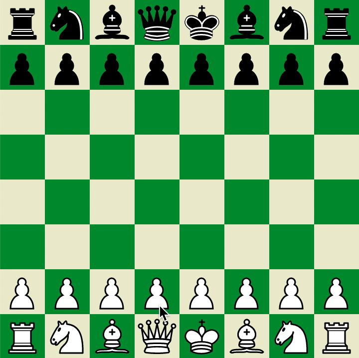

This is a simple hotseat multiplayer chess game with a crappy heuristic-based AI.
It mostly served as a sandbox for me to play with chess stuff, so the UI is pretty rough.

It's written entirely in [Elm](https://elm-lang.org/) using the fantastic [elm-ui](https://package.elm-lang.org/packages/mdgriffith/elm-ui/latest/) library.

If you're looking for an elm chess library, skip my code and check this library out:
https://package.elm-lang.org/packages/romstad/elm-chess/1.1.2/

# Installation
1. install Elm: https://guide.elm-lang.org/install/elm.html
2. install project dependencies
    ```shell script
    cd elm-chess
    elm install
    ```
3. Run elm reactor
    ```shell script
    elm reactor
    ```
4. open http://localhost:8000/src/App.elm in a web browser.

# Features
- You can play chess. All the wacky things like castling, en passant, etc work.
- Bespoke artisanal "AI" with no machine learning. "Thou shalt not make a machine in the likeness of a human mind".
- You can load games in PGN format (if you sanitize them a bit first)


# Musing about state modeling tradeoffs
Other libraries keep things like king location, whether a player can castle, if a pawn can take en passant, etc in the model.
I decided not to do that, and instead figure out information like that on the fly based on the pieces on the board and the past moves that were made.
My Position type has the move history, the pieces on the board, and the current player to move.
The main benefit of this is that it reduces duplicated information, which cuts down on the number of illegal states that are representable.
For example, the state can never indicate that both kings are on the same square, because each square can only hold one king.
The state also can't say a player can castle when they've already castled.

The potential illegal states that I can represent: pieces on the wrong square, illegal moves, wrong player to move.

The downside to this is that it is WAY less performant, by at least a factor of `O(history_length)`, because I have to iterate over the history and the board to find stuff.
To see if a player can castle, I need to iterate over their past moves and see if they've moved their king.
And to see if a player is in check, we have to iterate over the board to find the king.
Every possible move that's generated is run through a filter to see if it would leave the player in check, so for every possible move,
we're iterating over the whole board an extra time.

If I were to release this as a library, I would cache more in the model, and write more tests to compensate.


# Missing features
- There's no promotion UI, so when a pawn reaches the end of the board, I just turn it into a Queen.
  For amateur chess players like me, this is fine, but for fancier folks, it is sometimes necessary to promote to a rook, bishop or knight to avoid a draw.
- Draws are only detected when the player is not in check and has no legal moves. All other ways to draw (threefold repetition, 50 move rule, no possible checkmate, etc) are not checked for.
- PGN movetext parsing only supports moves and move numbers. It doesn't support additional things people use to add flavor to games
  like adding + to indicate check, ? to indicate blunders, or ! to indicate cool moves. Also doesn't support comments.

# AI
I was curious to see how well a simple heuristic based AI would do. It's not great at chess, but neither am I, so I'm pretty happy with it.
It just looks at the current set of legal moves, scores them, and picks the best one.

The scoring is based on the sum of some subscores:
- checkmate gets a zillion points
- maximize the difference between the number of squares you threaten and the number of your squares threatened by the enemy.
    - this rule is key to making the AI look smarter than it is. Building a strong position is often better than just taking a piece.
- moving a piece that was moved last turn is penalized
- will the move promote a pawn? This is valued very highly.
- will the move capture a piece?
- medium penalty for moving a King (unless castling), small penalty for moving a Queen
- moving pawns 2 spaces is more desirable than moving them 1 space
- moving pawns in the middle of the board is more desirable than moving them on the wings
- putting the enemy in check (not checkmate) is only worth a tiny bit to serve as a tie breaker.


# Things I learned from this
- This is probably the most logically complex Elm app I've ever made. There are a lot of edge cases, there are many ways to
model the data. I continue to be impressed by how confident I feel when writing Elm code, and how often things just work on the first try.
- Elm's custom types (sum types in other languages) were really really nice for modeling moves. They made it really easy to
explicitly handle edge cases. For example, any time I'm processing moves, If I run into castling, I need to write custom logic
for it. Elm forces me to do that.
- I don't find myself spending much time debugging elm code, but when I do, the problem tends to fall in one of two categories:
  things not displaying right,
  or situations with a lot of manipulation of data that isn't in the model. The former class of errors is just inevitable as I still have a lot to learn about frontend development.
- Elm's parser library was extremely confusing at first glance, but quite nice once I got over the initial hurdle.
One thing that I find interesting is that parsers were pretty readable even before I knew how they worked. So the examples mostly made sense to me,
but when it came to writing my own, there was a lot of head scratching.
I think part of the confusion is that Parsers are kind of an abstract thing. Most of the time, my code takes in values and spits out values that map
pretty well to structures containing "plain old data". With Parsers, you're basically passing around and composing state machines for processing text.
So I've got the execution flow of my code to think about, and then the execution flow of the state machine that I'm generating to think about. I think
I'm getting better at working with things like this.


# Things to improve
- I have some really long functions with a lot of nested logic, the code would be more readable if I broke some of those into separate functions
- The AI code should be separated from Position
- Performance is pretty rough.
- Nothing is documented

# Attribution
Chess piece SVGs are from wikimedia user [Colin Burnett](https://en.wikipedia.org/wiki/User:Cburnett)

They released them under the following licenses: GFDL, BSD, GPL
